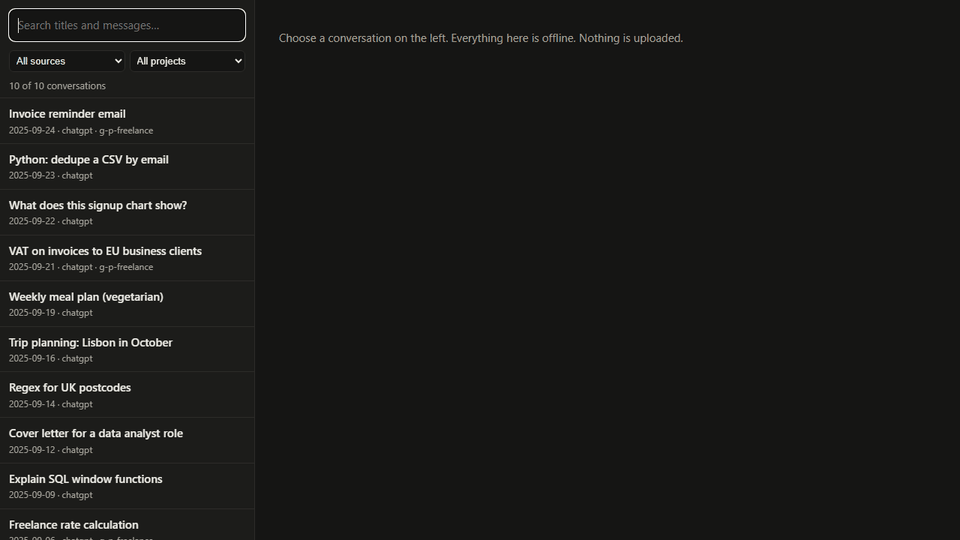
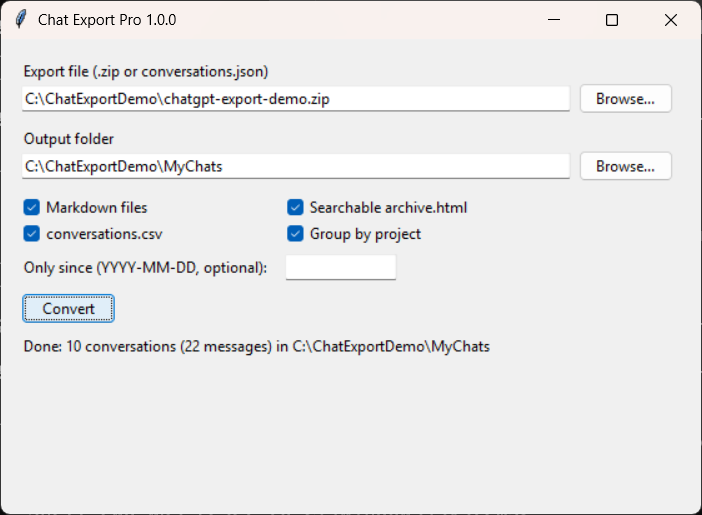
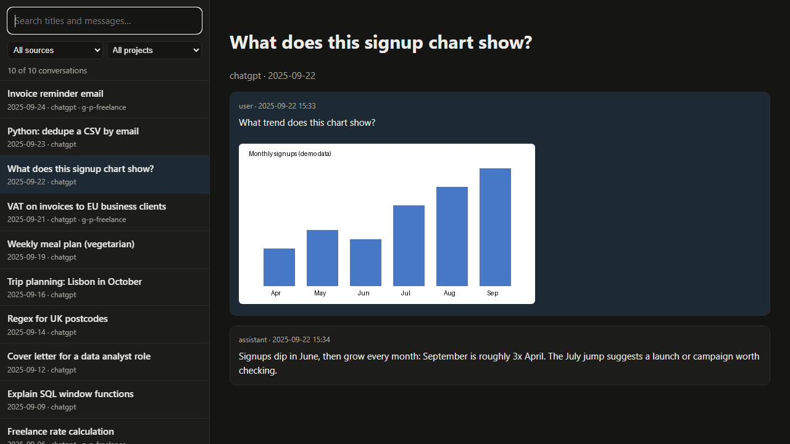
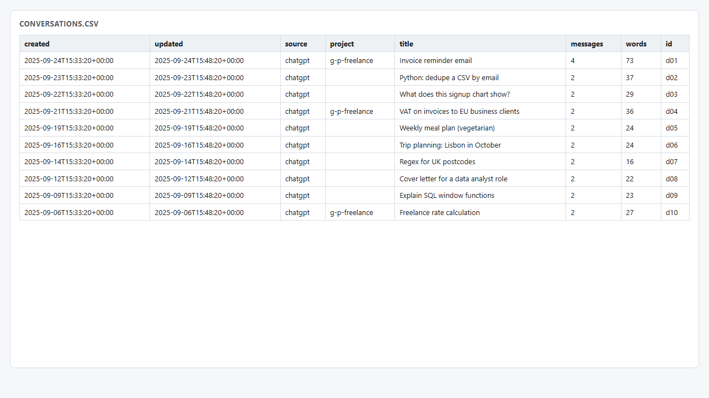

# ChatGPT & Claude export to Markdown (and a searchable offline archive)

Turn the **official data export** from ChatGPT or Claude (the ZIP you get by email) into readable files on your own computer: one Markdown file per conversation, with images, dates and project folders. It works offline. Nothing is uploaded, and you don't need a login or a browser extension.



**Two versions:**

| | **Free** (this repo) | **[Pro for Windows](https://samverse8.gumroad.com/l/chat-export-pro)** ($9) |
|---|---|---|
| Reads ChatGPT *and* Claude exports | ✅ | ✅ |
| Markdown files with YAML front-matter, images, project folders, `index.md` | ✅ | ✅ |
| Runs locally, no upload | ✅ | ✅ |
| Needs Python installed | yes (3.9+) | **no**: double-click `.exe` |
| Window with file pickers (no command line) | – | ✅ |
| **Searchable offline archive** (`archive.html`, one file) | – | ✅ |
| **`conversations.csv` index** for Excel | – | ✅ |
| License | MIT, source here | personal use; same open-source engine |

The free version is complete for Markdown conversion and has no limits or watermarks. Pro is for people who want a ready-to-run Windows app and the extra outputs. Buying it supports this project.

Full walkthrough: **[How to turn your ChatGPT or Claude data export into a searchable offline archive](https://samvsnvsn.github.io/chatgpt-claude-export-to-markdown/)**

## What it does

- Reads the **ChatGPT data export** and the **Claude data export** (`conversations.json` + `projects.json`), and detects which one it is.
- Supports the **current ChatGPT export format**: conversations split into `conversations-000.json`, `conversations-001.json`, … and large exports delivered as several `…-part-0001.zip`, `…-part-0002.zip` files (keep them in one folder and pass any part). Images stored as `.dat` files get their real extension back.
- **Follows the branch you actually saw.** ChatGPT stores edits and regenerations as a tree; you get the final conversation, without duplicates.
- Keeps code blocks (with language), code/tool output, quotes, Claude "thinking" blocks and Claude attachments' extracted text.
- Copies uploaded and generated **images** into `assets/` and links them.
- Puts **ChatGPT Projects** and **Claude Projects** into their own folders (`--flat` to turn off).
- Adds **YAML front-matter** (title, source, id, created, updated, project, model, message count), so it works well in **Obsidian**.
- Uses Windows-safe file names (`2025-09-24 Invoice reminder email.md`) and writes an `index.md` table of everything.
- New or unknown content types appear as a visible note instead of crashing the conversion.

Python 3.9+ standard library only; no dependencies.

## Install and run (free version)

```bash
pip install git+https://github.com/samvsnvsn/chatgpt-claude-export-to-markdown
chat-export ~/Downloads/chatgpt-export.zip -o my-chats
```

or, without installing (download the repo, then from its folder):

```bash
python -m chat_export path/to/export.zip -o my-chats
```

| Option | Meaning |
|---|---|
| `-o, --out FOLDER` | output folder (default `chat-export-markdown`) |
| `--since YYYY-MM-DD` | only conversations created on or after this date |
| `--flat` | don't group project conversations into folders |

To try it without your own data, use the made-up demo exports in [`examples/`](examples):

```bash
chat-export examples/chatgpt-export-demo.zip -o demo-chatgpt
chat-export examples/claude-export-demo.zip -o demo-claude
```

It also accepts a loose `conversations.json` or an unzipped export folder. Run it once per export: once for ChatGPT, once for Claude.

### Example output


```
my-chats/
  index.md
  2025-09-23 Python dedupe a CSV by email.md
  2025-09-22 What does this signup chart show.md
  assets/
    file-DEMO01-signups.png
  projects/
    g-p-freelance/
      2025-09-24 Invoice reminder email.md
```

## Pro for Windows

**[Chat Export Pro](https://samverse8.gumroad.com/l/chat-export-pro)** uses the same engine, packaged as a Windows app:

- **No Python or Node install.** Unzip and double-click `ChatExportPro.exe`.
- Choose the export ZIP, choose a folder, click **Convert**.

  

- In one step you get the Markdown folder, **`archive.html`** and **`conversations.csv`**:
  - **`archive.html`** is a single self-contained file: instant search across titles and messages with highlighted matches, filters by source and project, and inline images. It opens in any browser and works offline, with no external scripts or trackers.

    

  - **`conversations.csv`** is an index (date, source, project, title, message and word counts) that opens directly in Excel.

    

- Includes a command-line exe for scripting, a QUICKSTART, and SHA-256 checksums.

All screenshots use made-up demo conversations.

## How this compares with other free approaches

There are many good free tools for this; pick whatever fits you. The common approaches are:

- **Browser userscripts or extensions** export conversations from the live chatgpt.com or claude.ai page while you're logged in, often one at a time. This tool works on the official export ZIP instead, so it needs no login or extension and covers your whole history at once.
- **Python or npm converters** are usually for one provider (ChatGPT *or* Claude). This one reads both. The free version needs Python; Pro doesn't need anything installed.
- **Single-file HTML viewers** let you browse an export in the browser, usually for one provider. Pro produces a viewer *and* Markdown files *and* a CSV index from the same run.

## Getting your export

- **ChatGPT:** Settings → Data controls → Export data, then confirm. You get an email with a download link.
- **Claude:** Settings → Privacy → Export data. You get an email with a download link.

## Limitations

- Exports only contain what OpenAI and Anthropic include. Claude exports don't include the uploaded files themselves; their names and extracted text are kept.
- ChatGPT Project folders are named by project id (e.g. `g-p-…`) because the export doesn't include project names. Claude project names are used.
- Voice audio isn't included; transcriptions are.
- One export per run. ChatGPT and Claude exports produce separate outputs.

## License

MIT. See [LICENSE](LICENSE). Not affiliated with OpenAI or Anthropic; "ChatGPT" and "Claude" are trademarks of their respective owners.
