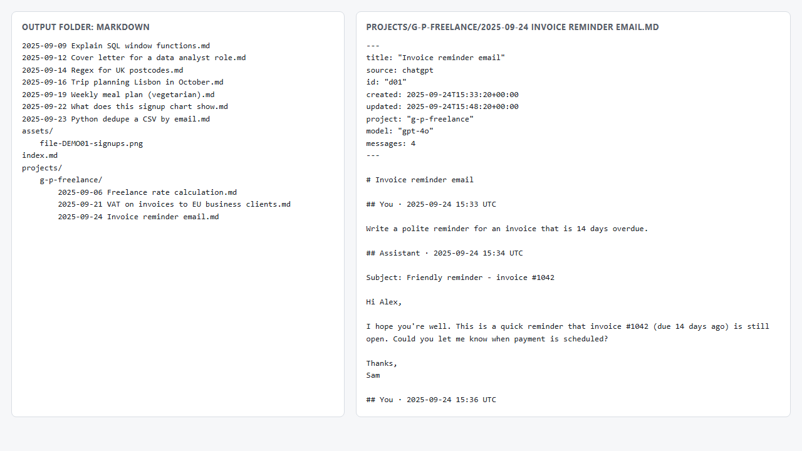
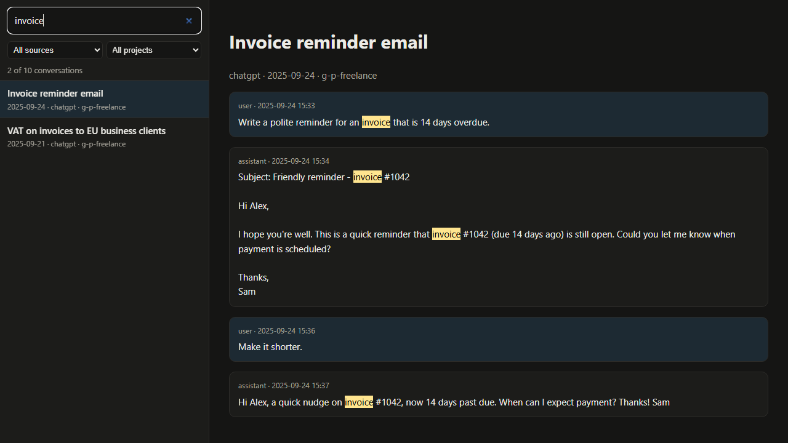

# How to turn your ChatGPT or Claude data export into a searchable offline archive

Years of conversations with ChatGPT or Claude end up holding drafts, code, research and decisions you'll want again. The chat apps' own search is limited, conversations get deleted, and accounts get closed. Both OpenAI and Anthropic let you download everything, but what you get is a ZIP with a very large JSON file that no one can read comfortably.

This guide covers:

1. [Getting your export](#1-get-your-export)
2. [What's actually inside the ZIP](#2-whats-inside-the-export)
3. [Turning it into Markdown files (free)](#3-convert-it-to-markdown-free)
4. [Making it searchable offline](#4-make-it-searchable)
5. [Keeping it safe and up to date](#5-keep-it-private-and-current)

Everything here works on your own computer. You never need to upload your export to a website.

## 1. Get your export

**ChatGPT:** open **Settings → Data controls → Export data** and confirm. OpenAI emails you a download link when the file is ready; this can take from minutes to a few hours for large histories. The link expires, so download it soon.

**Claude:** open **Settings → Privacy → Export data**. Anthropic emails you a download link.

Save the ZIP somewhere private. It contains your full chat history.

## 2. What's inside the export

**ChatGPT export** (key files):

| File | What it holds |
|---|---|
| `conversations.json` | every conversation, as one big JSON list |
| `chat.html` | all chats on one long page. It's readable, but it has no search box or filters, and large histories can be slow to open |
| `file-…` files (images) | pictures you uploaded or generated, referenced from the conversations |
| `user.json`, `message_feedback.json`, … | account details and feedback |

Each ChatGPT conversation is stored as a **tree**, not a list. When you edit a message or regenerate an answer, ChatGPT keeps both versions as branches. `current_node` marks the last message of the branch you were looking at. Walk back from it through each `parent` to recover the conversation as you saw it. A naive converter that prints every node shows edited and regenerated messages twice.

**Claude export:**

| File | What it holds |
|---|---|
| `conversations.json` | a list of conversations; each has `chat_messages` with `sender` (`human`/`assistant`), text and content blocks |
| `projects.json` | your Projects and their names |
| `users.json` | account details |

Claude messages can include "thinking" blocks, tool calls and attachments. For attachments, the export includes the **extracted text**, but not the original files.

### Look at it yourself

If you're comfortable with Python, a few lines list your ChatGPT conversation titles by date:

```python
import json, zipfile, datetime
with zipfile.ZipFile("chatgpt-export.zip") as z:
    conversations = json.loads(z.read("conversations.json"))
for c in sorted(conversations, key=lambda c: c.get("create_time") or 0):
    when = datetime.datetime.fromtimestamp(c.get("create_time") or 0)
    print(when.date(), c.get("title"))
```

For Claude, use `c["name"]` and `c["created_at"]` instead.

## 3. Convert it to Markdown (free)

Markdown is the most future-proof format for this: plain text files that any editor, Obsidian, VS Code or a search tool can open, now or in twenty years.

The free, open-source converter [chatgpt-claude-export-to-markdown](https://github.com/samvsnvsn/chatgpt-claude-export-to-markdown) does this for both providers:

```bash
pip install git+https://github.com/samvsnvsn/chatgpt-claude-export-to-markdown
chat-export chatgpt-export.zip -o my-chats
chat-export claude-export.zip -o my-claude-chats
```

You get:

- one `.md` file per conversation, named by date and title
- only the branch you actually saw
- images copied to `assets/` and linked inline
- code blocks with their language, so they stay highlighted
- ChatGPT and Claude **Projects** in their own folders
- YAML front-matter (title, dates, project, model, message count), which Obsidian's Properties view and Dataview can use
- an `index.md` listing every conversation



Use `--since 2025-01-01` to convert only recent conversations, for example to add new months to an existing archive.

## 4. Make it searchable

With a folder of Markdown files you have several good options:

- **Obsidian:** open the folder as a vault (or copy it into your vault). Full-text search, links and tags work immediately, and the front-matter shows up as properties.
- **VS Code:** open the folder and use *Search* (`Ctrl+Shift+F`), which supports regular expressions.
- **Command line:** `rg -i "invoice" my-chats` with [ripgrep](https://github.com/BurntSushi/ripgrep), or `findstr /s /i "invoice" *.md` on Windows.
- **Windows Explorer search** also finds text inside `.md` files once the folder is indexed.

If you'd rather have a single file you can double-click, with a search box and filters and no editor, you need an HTML viewer. The [Pro version](https://samverse8.gumroad.com/l/chat-export-pro) of the converter builds one (`archive.html`) in the same run, along with the Markdown files and a `conversations.csv` index for Excel. It's a ready-to-run Windows app, so there's nothing to install. It costs $9 and supports the free project; the free version above stays fully usable without it.



## 5. Keep it private and current

- **Don't upload your export to online converters.** It can contain personal details, work documents and anything you pasted into a chat. Prefer tools that run locally and that you can inspect.
- **Keep the original ZIP.** Converters improve, and the raw export is the only complete copy.
- **Re-export periodically** (say, every few months). Each export contains your full history, so convert it into a new folder, or use `--since` to add only newer conversations.
- **Back up the output folder** like any other documents. Plain files are easy to copy, sync or encrypt.
- Remember what isn't in exports: voice audio (transcripts are kept), the original files you attached to Claude chats, and anything already deleted in the app before you exported.

---

*Not affiliated with OpenAI or Anthropic. ChatGPT and Claude are trademarks of their respective owners. Screenshots use made-up demo conversations.*
